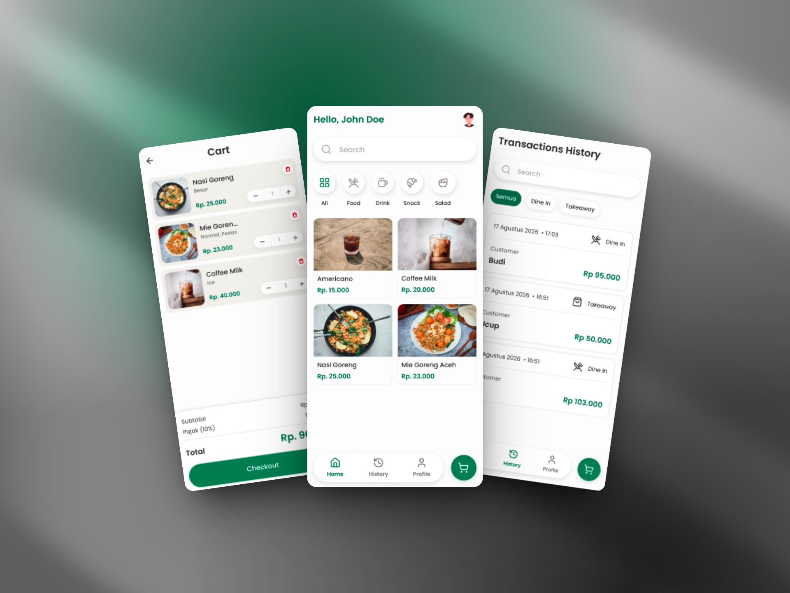

# Roastr POS App

Roastr POS App is a Point of Sale application designed specifically for the Roastr business. It is a full-stack solution featuring a mobile interface and a robust backend system. This application streamlines daily cashier operations, manages product inventory, and provides real-time sales analytics to monitor business performance.

## 📱 UI & Mockup Preview

<!-- Tempatkan screenshot / mockup gambar Anda di bawah ini -->
<!-- Contoh: simpan gambar di folder `assets/mockups/` atau lampirkan link image -->

<p align="center">
  
</p>

## 🚀 Features

### Authentication & Security

- **Role-Based Access Control (RBAC):** Secure access separated into Admin and Cashier roles.
- **User Authentication:** Secure Login and Logout functionality using JWT.
- **Password Management:** Features to change password and a 'Forgot Password' flow utilizing OTP/Verification Code sent via email.

### 👑 Admin Features (Back-Office)

- **Employee Management:** Complete CRUD operations for Cashier and Admin accounts.
- **Category Management:** Organize products with custom categories and icons.
- **Product Management:** Full control over the product catalog, including prices, variants, images, and category assignments.
- **Analytics Dashboard:**
  - **Key Metrics:** Real-time insights into Today's Revenue, Today's Transactions, and Average Order Value (AOV).
  - **Sales Trend Chart:** Line chart displaying revenue trends with dynamic time filters (Today, This Week, This Month).
  - **Order Type Composition:** Donut chart comparing the percentage of Dine-in vs. Takeaway transactions.
  - **Top 5 Best-Selling Products:** Ranked list based on portions sold and total revenue generated (filtered by 'Today').
- **Transaction History:** Access and review detailed records of all past transactions.

### 🛒 Cashier Features (Point of Sale)

- **Product Catalog:** Browse products with options to filter by category or view all.
- **Cart Management:** Seamlessly add products, adjust quantities, and manage items in the cart.
- **Efficient Checkout Process:**
  - Select order type (Dine-in or Takeaway).
  - Input customer information (Name, optional Email).
  - Input cash received, with automatic change calculation.
- **Transaction History:** View past transactions filtered by All, Dine-in, or Takeaway, along with order details.
- **Digital Receipts:** Option to send receipts/invoices directly to the customer's email upon successful checkout.

## 🛠️ Tech Stack

### Frontend (Mobile/Tablet)

- **Framework:** [Flutter](https://flutter.dev/)
- **State Management:** [Provider](https://pub.dev/packages/provider)
- **Routing:** [go_router](https://pub.dev/packages/go_router)

### Backend (REST API)

- **Environment:** [Node.js](https://nodejs.org/)
- **Framework:** [Express.js](https://expressjs.com/)
- **Database:** [MongoDB](https://www.mongodb.com/) (using Mongoose)
- **Authentication:** JSON Web Tokens (JWT) & bcryptjs
- **Email Service:** [Resend](https://resend.com/) (for digital receipts and password reset OTPs)

## 📁 Project Structure

This project follows a monorepo-style structure, housing both the frontend and backend in a single repository:

```text
roastr/
├── server/          # Node.js & Express API
├── client/         # Flutter Application
```

_(See individual README files within `server/` and `client/` for setup instructions for each environment)._
